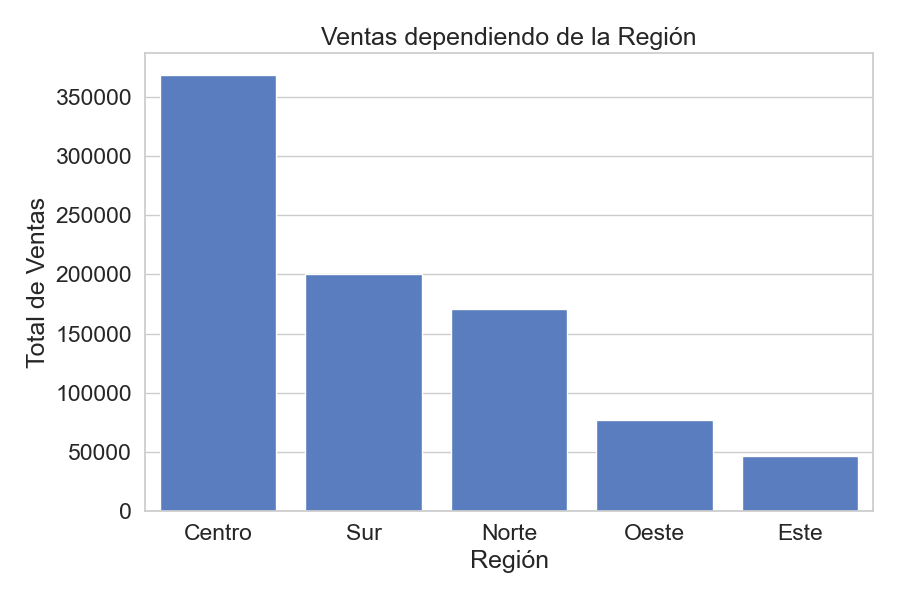
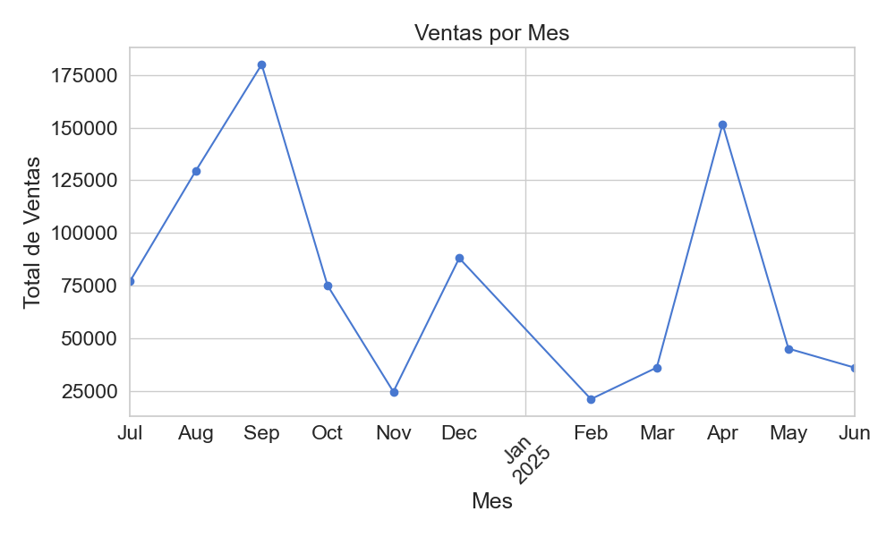
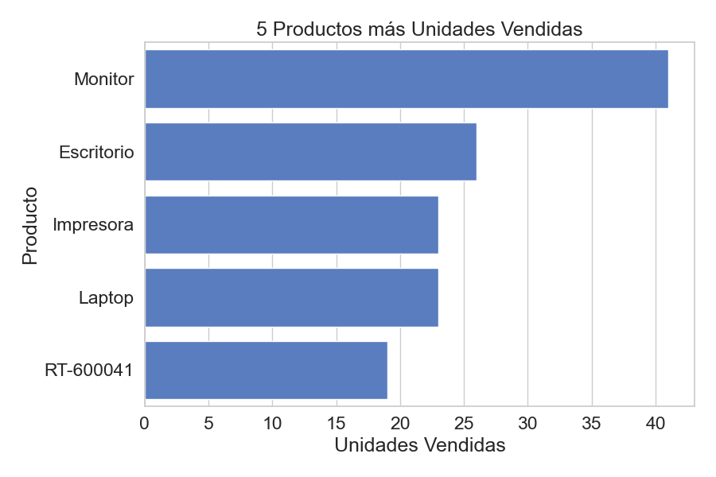

# Proyecto 1 — Análisis de Ventas de Negocio (End-to-End)

Este proyecto simula un caso real de análisis de ventas para un negocio utilizando un flujo de trabajo profesional de ciencia de datos. Incluye desde la creación de bases de datos SQL, consultas, análisis en Python, visualización de datos y exportación de reportes automatizados. Todo apto para revisión de portafolio profesional.

---

## 🔧 Tecnologías utilizadas

- Python 3.12
- SQLite
- pandas
- matplotlib
- seaborn
- Excel (openpyxl)
- Git & GitHub
- VSCode + Anaconda

---

## 📊 Objetivo del proyecto

El objetivo es demostrar dominio de herramientas fundamentales de análisis de datos realizando:

- Creación de base de datos relacional.
- Ingesta y limpieza de datos.
- Análisis descriptivo de ventas, clientes y productos.
- Generación de KPIs clave.
- Visualización de resultados.
- Exportación automatizada de reportes en Excel.

---

## 📁 Estructura de archivos

📦 Proyecto1-analisis-datos-negocio
│
├── crear_base.py         # Creación de la base de datos y tablas
├── insertar_datos.py     # Inserción de datos simulados
├── consultas_sql.py      # Consultas básicas de ejemplo
├── analisis_avanzado.py  # Análisis completo de ventas
├── graficos.py           # Visualización automatizada de resultados
├── empresa.db            # Base de datos SQLite generada
├── reporte_analisis.xlsx # Reporte final en Excel
├── grafico_region.png    # Gráfico de ventas por región
├── grafico_mes.png       # Gráfico de ventas por mes
├── grafico_productos.png # Gráfico de top productos
└── README.md             # Descripción del proyecto

---

## 📈 Ejemplos de resultados

## Ventas por Región

## Ventas por Mes

## Producto más vendido

---
